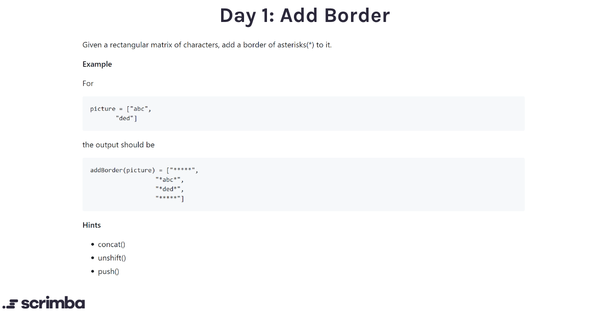
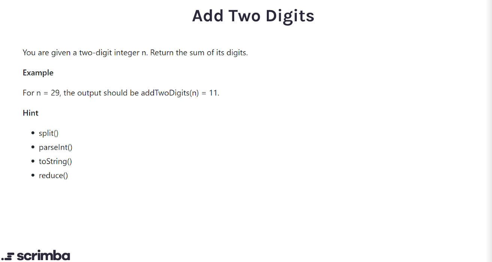
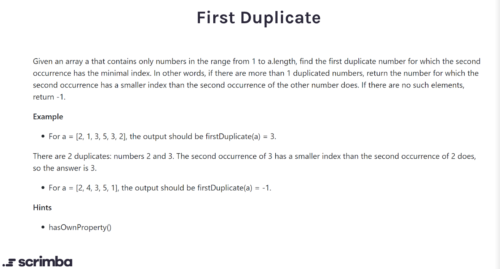
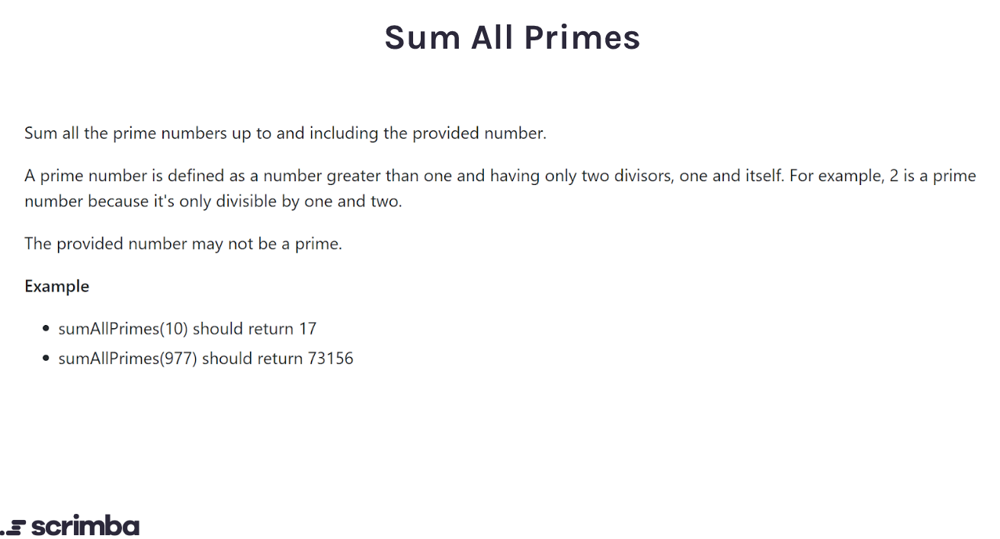
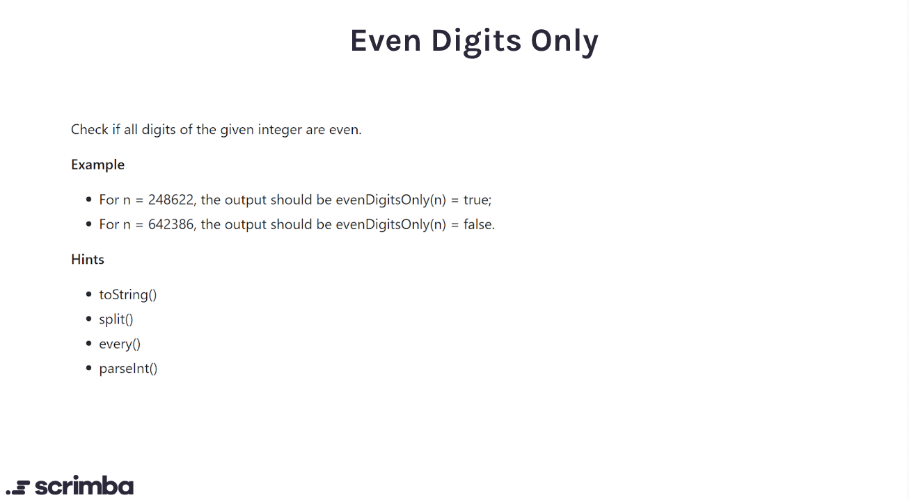
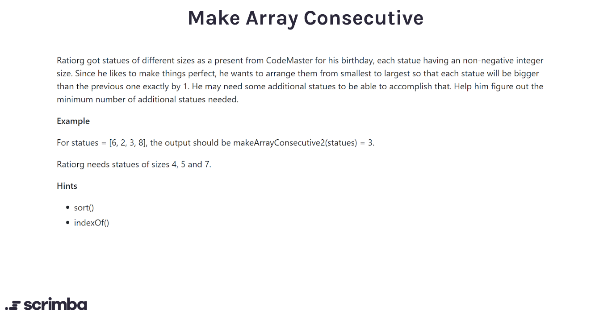

# 7-day JavaScript challenge

## Challenges

### [Day 1 - Add Border](#add-border)

### [Day 2 - Add Two Digits](#add-two-digits)

### [Day 3 - First Duplicate](#first-duplicate)

### [Day 4 - Sum All Primes](#sum-all-primes)

### [Day 5 - Even Digits Only](#even-digits-only)

### [Day 6 - Make Array Consecutive](#make-array-consecutive)

